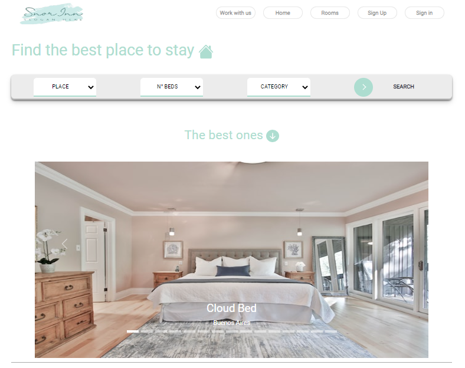

#  SnorInn-App - Group Project

**Group project made as an evaluative instance at [Soy Henry](https://www.soyhenry.com/)'s web development bootcamp.**

**This Single Page Application (SPA) developed using agile software methodologies (SCRUM), with one-week-long sprints, offer the possibility to connect all those who have a space or place intended to host tourists (be they: in houses, hotels, hostels, bed and breakfast...), and those tourists who want to find their best place to rest.**
**SnorInn make it simple to load rooms and to rent them too. Providing all the necessary information to decide which is the best place for you. You can register quickly and safely, search for your dream room, reserve it by date and pay for it.**

## 💻 **Used Technologies**

- **HTML**
- **CSS**
- **Bootstrap**
- **TypeScript**
- **React**
- **Redux Toolkit**
- **Node.js**
- **Express.js**
- **MongoDB-Atlas | Mongoose**
- **Bcrypt | JSONWebToken | Nodemailer | Google-auth-library**
- **Stripe**
- **Cloudinary**
- **Trello**

## 💻 **Deployed version**

⭐ <a href='https://snor-inn.vercel.app/' target='_blank'>Visit SnorInn</a>